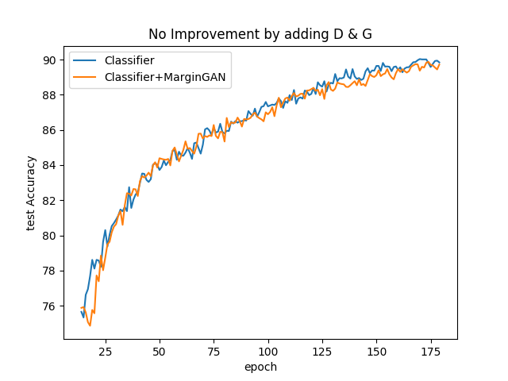
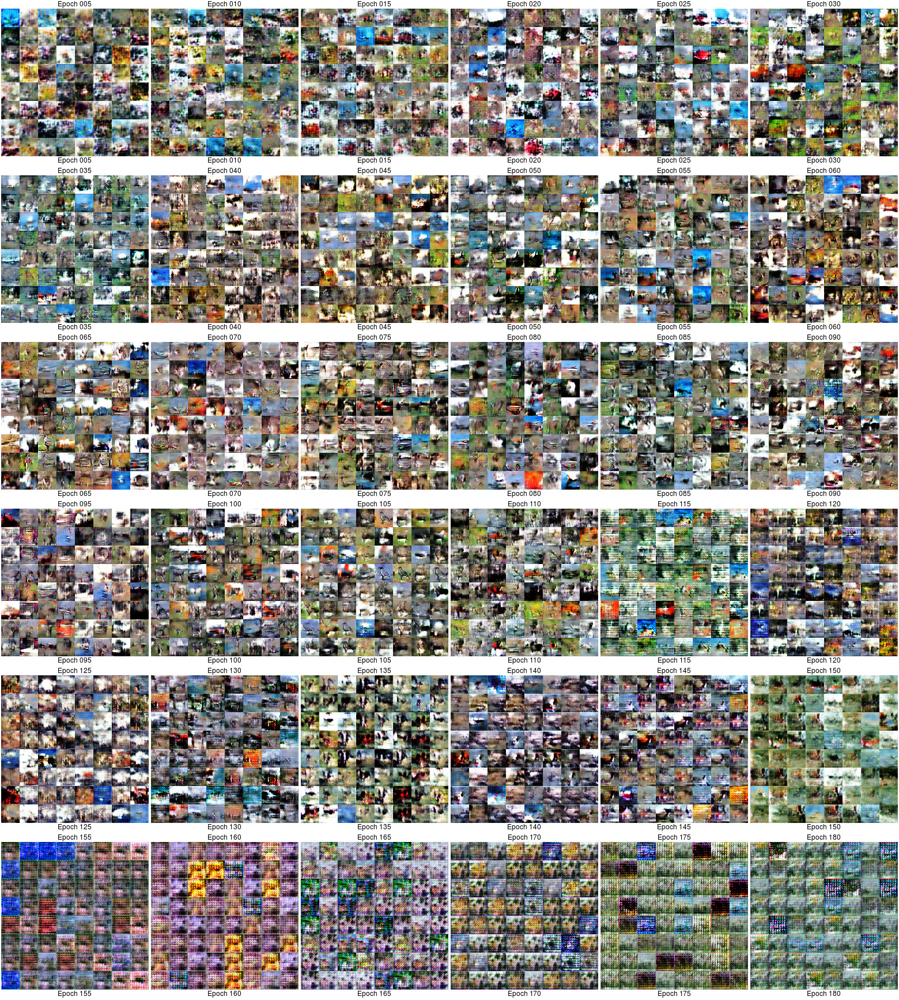
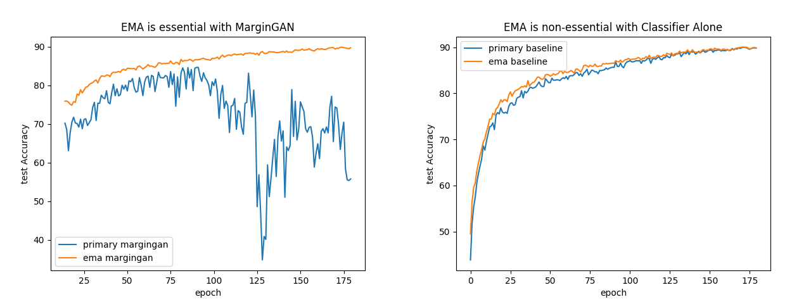

# MarginGAN
This repository is the implementation of the paper "MarginGAN: Adversarial Training in Semi-Supervised Learning".

## Results on CIFAR 1k labels total ("further" experiment)

On 4x1080s, Runs 1 epoch per 4.33 mins. Finishes 180 epoch (91k itr) in 13 hours.
On 4x1080s, the baseline (skips optimizing terms for D and G loss) runs 1 epoch per 3 mins. Finishes 180 epoch (91k itr) in 9 hours.

Paper reports 10.39 +/- 0.43 error rate. This is achieved by the ema model of both MarginGAN and its baseline (classifier without the GAN):



The generator of MarginGAN is clearly mode collapsed throughout training:



Below is a plt of the ema vs primary model performance for MarginGAN.



There is a big gap, and ema is helping a lot. For the baseline (classifier alone) there is no such gap, ema and primary are practically equal.

## Experiments

1."preliminary" is the implementation of **Preliminary Experiment on MNIST** of the paper. Thank the authors of [pytorch-generative-model-collections](https://github.com/znxlwm/pytorch-generative-model-collections) and [examples of pytorch](https://github.com/pytorch/examples/blob/master/mnist/main.py), our code is widely adapted from their repositories.

To train the network, an example is as follows:
```
python main.py \
  --gan_type MarginGAN \
  --num_labels 600 \
  --lrC 0.1 \
  --epoch 50
```

2."ablation" is the implementation of **Ablation Study on MNIST** of the paper. 
To train the network, an example is as follows:
```
python main.py \
--gan_type MarginGAN_UG \
--num_labels 600 \
--lrC 0.01 \
--epoch 50
```

3."further" is the implementation of **Experiment on SVHN and CIFAR-10** of the paper. Thank the authors of [mean teacher](https://github.com/CuriousAI/mean-teacher), our code is widely adapted from their repositories.

To train the network, an example is as follows:
```
python MarginGAN_main.py \
    --dataset cifar10 \
    --train-subdir train+val \
    --eval-subdir test \
    --batch-size 128 \
    --labeled-batch-size 31 \
    --arch cifar_shakeshake26 \
    --consistency-type mse \
    --consistency-rampup 5 \
    --consistency 100.0 \
    --logit-distance-cost 0.01 \
    --weight-decay 2e-4 \
    --lr-rampup 0 \
    --lr 0.05 \
    --nesterov True \
    --labels data-local/labels/cifar10/1000_balanced_labels/00.txt  \
    --epochs 180 \
    --lr-rampdown-epochs 210 \
    --ema-decay 0.97 \
    --generated-batch-size 32
```

## Installation

run

```
conda env create -f py3p5torch0p4p1.yml
conda activate py3p5torch0p4p1
```

Works on multiple gpus with cuda/9.2.148, cudnn/v7.6.5, python 3.5, pytorch 0.4.1.

## Instructions for the experiment "further"

### Create data in a custom directory

```
cd further/data-local/bin

python unpack_cifar10.py /scratch0/ilya/locDoc/data/margingan /scratch0/ilya/locDoc/data/margingan/cifar10

cd /scratch0/ilya/locDoc/data/margingan/cifar10

mkdir -p train/airplane
mkdir -p train/automobile
mkdir -p train/bird
mkdir -p train/cat
mkdir -p train/deer
mkdir -p train/dog
mkdir -p train/frog
mkdir -p train/horse
mkdir -p train/ship
mkdir -p train/truck

mkdir -p val/airplane
mkdir -p val/automobile
mkdir -p val/bird
mkdir -p val/cat
mkdir -p val/deer
mkdir -p val/dog
mkdir -p val/frog
mkdir -p val/horse
mkdir -p val/ship
mkdir -p val/truck

sh /MarginGAN/further/data-local/bin/cp_cifar10_train.sh
sh /MarginGAN/further/data-local/bin/cp_cifar10_val.sh
```

### how to run

`cd further` and run `sh train.sh` for the 1k labels total experiment.

Exclude the `--datadir` and `--results-dir` to load data and save results inside this repository, or modify them to use custom directories.

Monitor with: `grep "* Prec@1" /vulcanscratch/ilyak/experiments/MarginGAN/pytorch_2020-08-25_16:03:18.log`, note that these precisions alternate between evaluations using the primary and ema model.
